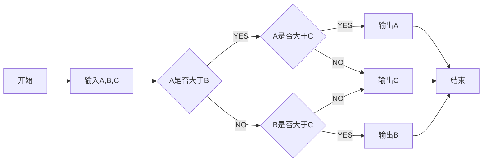

#### 1、标题

```
# 标题1
## 标题2
### 标题3
#### 标题4
##### 标题5
###### 标题6
```

#### 2、列表

##### 2.1  无序列表：

```
*  无序列表
```

* 第一个
* 第二个

##### 2.2 有序列表

````
1. 有序列表
````

1. 第一个
2. 第二个

#### 3、代码段：

```
​```  ```  三个反点对之间。 单个反点对 ` `句内代码段
```

```python
print("hello world")
```

#### 4、强调段落：

```
> 一个大于号 
```

> 这是一段测试文本。
>
> 测试 > 的效果

#### 5、网站链接：

```
[]()    [华龙证券](http://www.hlzq.com)
```

[华龙证券](http://www.hlzq.com)

#### 6、图片链接：

```
   
```


#### 7、数学公式

```shell
# $$    $$     :2对美元符号之间
\frac{-b\pm\sqrt{b^2-4ac}}{2a}
# $ 一个$表示行内公式，有些编辑器不支持
```

$$
\frac{-b\pm\sqrt{b^2-4ac}}{2a}
$$

​      行内公式：一元二次方程的可能实根公式是$ \frac{-b\pm\sqrt{b^2-4ac}}{2a} $。

https://math.meta.stackexchange.com/questions/5020/mathjax-basic-tutorial-and-quick-reference

#### 8、分割线

```
--- 三个减号，上下最好空一行。
```

---


#### 9、流程图



语法参考：[http://knsv.github.io/mermaid](https://link.jianshu.com/?t=http://knsv.github.io/mermaid)

​                   https://mermaidjs.github.io/

```shell
流程图方向有下面几个值

TB 从上到下
BT 从下到上
RL 从右到左
LR 从左到右
TD 同TB

id + [文字描述]矩形
id + (文字描述)圆角矩形
id + >文字描述]不对称的矩形
id + {文字描述}菱形
id + ((文字描述))圆形

A --> B     A带箭头指向B
A --- B      A不带箭头指向B
A -.- B      A用虚线指向B
A -.-> B    A用带箭头的虚线指向B
A ==> B   A用加粗的箭头指向B
A -- 描述 --- B       A不带箭头指向B并在中间加上文字描述
A -- 描述 --> B      A带箭头指向B并在中间加上文字描述
A -. 描述 .-> B      A用带箭头的虚线指向B并在中间加上文字描述
A == 描述 ==> B  A用加粗的箭头指向B并在中间加上文字描述

# 自定义样式
graph LR
    id1(Start)-->id2(Stop)
    style id1 fill:#f9f,stroke:#333,stroke-width:4px,fill-opacity:0.5
    style id2 fill:#ccf,stroke:#f66,stroke-width:2px,stroke-dasharray: 10,5
```

#### 10、UML流程图

```flow
st=>start: Start|past:>http://www.google.com[blank]
e=>end: End:>http://www.google.com
op1=>operation: My Operation|past
op2=>operation: Stuff|current
sub1=>subroutine: My Subroutine|invalid
cond=>condition: Yes or No?|approved:>http://www.baidu.com
c2=>condition: Good idea|rejected
io=>inputoutput: catch something...|request

st->op1(right)->cond
cond(yes, right)->c2
cond(no)->sub1(left)->op1
c2(yes)->io->e
c2(no)->op2->e
```

语法参考：[https://github.com/adrai/flowchart.js](https://link.jianshu.com/?t=https://github.com/adrai/flowchart.js)

#### 11、UML序列图

```sequence
Title:连接建立的过程
客户主机->服务器主机: 连接请求（SYN=1,seq=client_isn） 
服务器主机->客户主机: 授予连接（SYN=1,seq=client_isn）\n ack=client_isn+1
客户主机->服务器主机: 确认（SYN=0,seq=client_isn+1）\nack=server_isn+1
```

语法参考：[https://bramp.github.io/js-sequence-diagrams/](https://link.jianshu.com/?t=https://bramp.github.io/js-sequence-diagrams/)

#### 12、取目录

```shell
# 在文档的任何地方输入（目录必须是标题性质的）：
[TOC]
```


#### 13、todo 列表

```shell
* [ ]   方括号前后要有空格
```

* [ ] 第一个
* [ ] 第二个
* [ ] 第三个


#### 14、粗体、斜体和删除

```shell
**这是粗体** 
_这是斜体_
~~这是删除~~
```

**这是粗体**
_这是斜体_

~~这是删除~~

#### 15、字体设置

```shell
<font face="微软雅黑" color="red" size=20>我是微软雅黑</font>
```


<font face="微软雅黑" color="red" size=20>我是微软雅黑</font>

