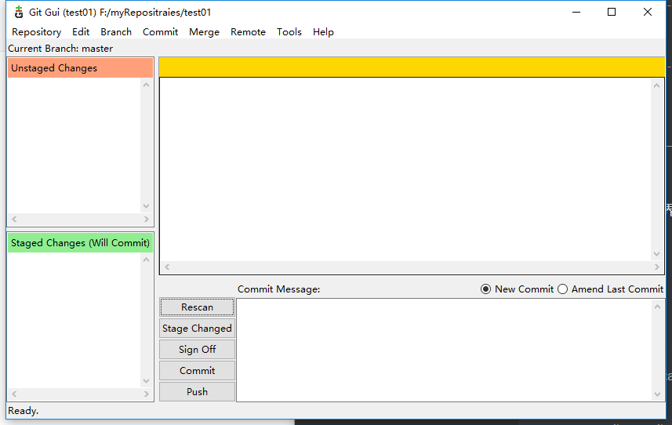
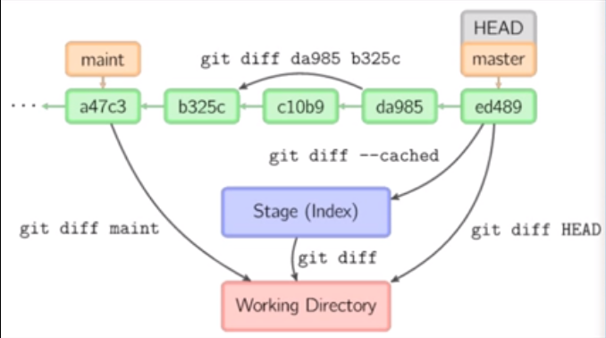
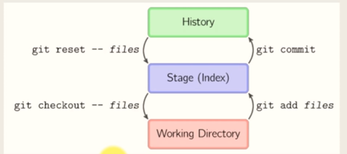

### 一、简单体验

#### 1.1、git是什么？

* 最初是用来管理代码：分布式版本控制系统
* 现在：写小说、写日志、写日记、免费的存储空间、书籍翻译等等
* github大牛们云集的地方

#### 1.2、github网站：

https://github.com   github 网站

https://gitstar-ranking.com/repositories    github 开源项目排行榜

free-programming-books          github 上一个免费书籍项目

##### 1.2.1    浏览网站结构

* linus。
* git   Linux Kernel  perl  eclipse  gnome  kde  docker   react  ruby on rails  android  postgresql   debain 

1.2.2、 创建自己的账户

* 大致了解仓库、提交、设置等等

##### 1.2.3、安装git 客户端：

> * windows下安装：
>
>   https://git-scm.com/
>
> * centos 7 下安装：
>
>   yum -y install git

##### 1.2.4、一个简单的实验。

* 构建仓库：在github上面创建一个仓库testgit

* 本地下载仓库：git clone htts://github.com/zhangsan/testgit

* 在本地编写点内容:

  touch -a

  git add .

  git commit -m "first commit"

* (push，最大100M限制，可配置) 可以将github当作一个云端网盘

#### 3、git、github、gitlab

* git：是一个开源的分布式版本控制系统，作者linus,bitkeeper,samba,two weeks。
* github：是一个网站，来管理git项目（仓库）,最著名的开源网站
* gitlab：是一个基于git系统的开源项目

### 二、git   bash的基本使用

#### 2.1、重要概念：

> 
>
> - Workspace：工作区，工作目录，我们在本地的仓库（项目）目录。我们修改、创建文件等操作都是先在工作区中操作。
> - Index / Stage：暂存区，工作区修改确认的文件添加到暂存区里，可以多次加入，分批或者一次提交到本地仓库，为了项目颗粒度的管理，只有进了暂存区的文件，git才会去跟踪。
> - Repository：仓库区（或本地仓库），把暂存区或工作区提交状态保存起来。
>
> 
>
> * Remote：远程仓库，与本地仓库进行交换，分工协作的目的，分布式代码管理。


#### 2.2、常用命令：

```shell
git version  # 查看版本
git config --list   # 显示全局配置
git config --global user.name "laoxian423"   # 配置用户名
git config --global user.email "362293069@qq.com" # 配置邮箱
```

```shell
git add f1  #  添加文件到暂存区,f1是示例文件
git add .   # 全部进暂存区
git reset f1  # 从暂存区回退到工作区
git rm f1 # 删除工作区文件，并且将这次删除放入暂存区（该文件必须已经提交）
git mv f1 # 改名文件，并且将这个改名放入暂存区（该文件必须已经提交）
git commit -m "this is a commit" #提交暂存区到本地仓库
git commit -am "11111" #直接从工作区提交到仓库（前提是该文件已经有仓库中的历史版本）
git status #查看当前仓库状态
git status -sb #查看当前仓库状态(简略显示)
git log  # 显示当前分支的历史版本
git log --oneline  # 简略显示
git clone https://github.com/zhangsna/testgit  # 克隆远程仓库到本地
git remote -v  # 查看和远程仓库建立的链接信息
git remote add [shortname] [url] # 增加远程仓库的链接并命名
git push  # 将本地的提交推送到远程仓库
git pull  # 将远程仓库拉到本地仓库
git help -a # 查看所有子命令
```
#### 2.3、常用命令实例：


* 创建第一个仓库
```shell
# 环境：
#   我们在 D 盘 （以下都是在Windows上实验，如果你是linux，请忽略某某盘的语句，除了盘符其他操作都一样），创建一个my_repositories 的目录，作为后面所有实验用的总目录，以后所有的仓库都放在这个目录里。
# 1、在github上创建一个仓库testgit
# 2、本地操作：
mkdir /d/my_repositories
cd /d/my_reposistories/
# 3、将远程仓库克隆下来
git clone https://github.com/zhangsan/testgit
# 4、查看testgit的目录结构，观察里面多了些什么
ls -la
# 5、看看目录中.git子目录中的文件,.git目录实际就是本地仓库
$ ls -la ./.git
# 6、查看连接的远程仓库
git remote -v
```

* 管理第一个文件

```shell
touch fix_list        # 创建一个空文件，文件名为 fix_list
git status            # 查看当前仓库状态
git status -sb        # 查看状态（简略方式）
vim fix_list          # 编辑 fix_list
#-------------- fix_list 内容  ---------------------------------
1 ： 自选股行情列表变形，存在适配问题。
#-----------------  内容结束 -----------------------------------
git status            # 查看仓库状态
git status -sb        # 查看仓库状态
git add .             # 将工作区中未提交暂存区的改变都加入暂存区中
git status            # 查看仓库状态
git status -sb        # 查看仓库状态
vim fix_list          # 编辑 fix_list
#-------------- fix_list 内容  ---------------------------------
1 ： 自选股行情列表变形，存在适配问题。
2 :  行情数据不准确。
#-----------------  内容结束 -----------------------------------
git status            # 查看仓库状态
git status -sb        # 查看仓库状态

git add .             # 将工作区中未提交暂存区的改变都加入暂存区中
git status            # 查看仓库状态
git status -sb        # 查看仓库状态

git commit -m "this is my first commit"  # 提交本地仓库
git status            # 查看仓库状态
git status -sb        # 查看仓库状态

git log               # 查看提交历史
# 设置易读的历史日志格式
vim ~/.gitconfig
#  ------------------ ~/.gitconfig 新增内容 ---------------------------------
[alias]
	hi =  log --pretty=format:'%h %ad | %s%d [%an]'  --graph --date=short
# -----------------------------------------------------------------------------
git hi               # 自定义显示历史日志，给 log 起了个别名

git push             # 将本地仓库推送到远程仓库
```

#### 2.4、git 跟踪哪些操作

> ​     只有放进过暂存区中的文件，git 才能跟踪，git能够跟踪文件的操作：
>
> * 添加新文件
> * 删除文件
> * 编辑文件（增加能容，删除内容，修改内容）
> * 文件改名
> * 文件移动
> * 文件夹的操作（添加、删除、改名、移动）

#### 2.5、git 图形界面工具

* 可以自行找一些图形环git log的软件，可以对多分支工作流有一个直观认识。

  

  

#### 2.6、git  配置文件

* ~/.gitconfig  配置文件，Linux下/etc/gitconfig （全局配置文件）

```shell
git config --list  # 查看配置
git config --global user.name "user_name"  # 用户名
git config --global user.email zhangsan@qq.com   # 邮箱
git config --global core.editor emacs   # 配置默认编辑器
git config --global core.autocrlf false  # 回车换行的处理，如果程序只在windows上开发运行，就设置为false
git config --global alias.ci commit # 增加别名
git config --global credential.helper store --file=git_credentails # 保存用户凭证，免得每次输密码
# 日志格式化，lg 更漂亮一些：
[alias]
	hi =  log --pretty=format:'%h %ad | %s%d [%an]'  --graph --date=short
    lg = log --color --graph --pretty=format:'%Cred%h%Creset -%C(yellow)%d%Creset %s %Cgreen(%cr) %C(bold blue)<%an>%Creset' --abbrev-commit
```

* ~/.gitignore  忽略跟踪的文件

   每一行代表一个或一类要忽略的文件，支持通配符。

   git rm -r --cached .     #  如果.gitignore 不起作用、

#### 2.7、git 协议

* 本地：  git  clone  /c/wd/test.git

* git协议： git clone git://server_ip/test.git    没有权限管理，访问速度最快

* http协议：git clone https://github.com/zhangsan/test.git

* ssh协议：

  ```shell
  git clone ssh://git@github.com/laoxian/test.git
  git clone git@github.com:laoxian/test.git
  git remote add origin git@github.com:laoxian/test.git
  
  # 生成RSA密钥对
  ssh-Keygen -t rsa -C "your email"
  cat ~/.ssh/id_rsa.pub  # 复制粘贴内容
  # 把生成的公钥配置到github网站上settings :
  ==》"SSH and GPG keys"
  ==》"new"
  git clone git@github.com:laoxian/test.git   
  ```

#### 2.7、commit 提交信息的规范化：

> * 什么时候提交？什么情况下提交？
>
>   1. 以一个小功能、小改进或一个bug fix为单位
>   2. 对应的unit test 程序在同一个commit
>   3. 无相关的修改不在同一个提交
>   4. 语法错误的半成品程序不能 commit
>
> * Message 的书写规范：
>
>      (Angular规范：google的一款优秀的前端JS框架)
>
>   ```shell
>   # 1、格式：
>   <type>(<scope>):<subject>
>   //空一行
>   <body>
>   //空一行
>   <footer>
>   # 2、tpye 的说明：
>   feat: 新功能
>   fix： 修补bug
>   docs：文档
>   style：格式（不影响代码运行的变动）
>   refactor:重构（既不是新增功能，也不是修改bug的代码变动）
>   test:增加测试
>   chore:构建过程或辅助工具的变动
>   # 3、示例1：
>   ----------------------------------------------------------------
>   docs(README):ADD install
>   
>   增加了对安装过程的说明，修改了一些参数
>   
>   ----------------------------------------------------------------
>   # 4、示例2(关闭bug）：
>   ----------------------------------------------------------------
>   fix(menu.py,tools.py):FIX valueError
>   
>   修复了一个数值转换错误。 close #1
>   
>   ----------------------------------------------------------------
>   
>   ```

#### 2.8   git 的信息查看

```shell
# 信息查看
git status
git status -sb
# 查看提交历史
git log <filename>
git log --grep <msg>
git log -n  # n 是个数字
git hi  # 自定义别名
git lg  # 自定义别名
# 查看某个提交信息
git show 8938a3d   
git show HEAD    # 第一个
git show HEAD^   # 前一个
git show HEAD^^  # 前2个
git show HEAD~5  # 从HEAD数到第5个
git blame  <filename> # 逐行查看文件历史（每一行是谁敲的，什么时候敲的）
git blame -L 5,10 <filename>  # 从第5行开始查看到第10行
```

### 三、比较、回撤和标签：

#### 3.1 git  diff  比较操作：



```shell
# 按照上图，制作一个测试环境
touch a
echo 1111 >> a
git commit -am '1'
echo 2222 >> a
git commit -am '2'
echo 3333 >> a
git commit -am '3'
echo 4444 >> a
git commit -am '4'
echo 5555 >> a
git commit -am '5'
echo 6666 >> a    # 放在暂存区中
git add .
echo 7777 >> a    # 放在工作区中

git  diff --cached  # 比较暂存区和master
git diff HEAD  # 比较工作区和master
git diff    # 比较工作区和暂存区
git diff da988  cd112  # 比较这两个版本
```

#### 3.2 回撤操作



```shell
# 回撤暂存区内容到工作区
git reset HEAD

# 回撤提交到暂存区
git reset HEAD --soft

# 回撤提交，放弃变更,HEAD可以是任意一个提交
git reset HEAD  --hard

# 回撤远程操作，团队协作时不能这样做,其实是强制推送
git push -f

# 变基操作，改写历史提交
git rebase -i HEAD~3
```

####  8、标签操作

```shell
# 大版本，里程碑，重大变动上
# 在当前提交上，打标签,在HEAD上
git tag foo
git show foo

# 在当前提交上，打标签，并给message信息注释
git tag foo -m "message"

# 在当前提交之前的第4个版本上，打标签
git tag foo HEAD~4

# 列出所有标签
git tag

# 删除标签
git tag -d foo

# 把标签推送到remote
git push origin --tags  # 推送多个标签
git push origin v0.1   # 推送1个标签

# 删除远程仓库标签
git push origin :refs/tags/v0.0

```

### 四、分支操作


```shell
# 为解决并行开发
(master) git branch iss53
(master) git branch hotfix
(master) git merge hotfix
# 切换分支
(master) git checkout iss53
# 显示所有分支
git branch
git branch -v  # 显示分支并显示每个分支的当前提交
# 前向合并操作（简单的移动指针），注意：要把 A 合并 到 B 上，必须在B上操作，比如把hotfix合并到master，必须到master上操作
git checkout master
git merge hotfix
# 删除分支
git branch -d hotfix

# 解决冲突
# 模拟在两个分支中编辑同一个文件的同一个地方
```

```shell
# 常用分支命令
# 创建分支foo
git branch foo
# 切换到分支
git checkout foo
# 创建分支并同时切换到foo
git checkout -b foo
# 修改分支名字
git branch -m old_name new_name
git branch -M old_name new_name  # 强制执行
# 删除分支
git branch -d foo  # 未合并不允许删除
git branch -D foo  # 强制删除
# 列出远程分支
git branch -r
git branch -v # 本地带分支版本
# 查看已经合并的分支
git branch --merged
git branch --no-merged
# 列出远程合并的分支
git branch -r --merged
# 取出远程foo 分支
git checkout -t origin/foo
# 删除远程分支
git push origin <space>:<remote branch>  # 
git fetch -p
# 合并分支
git merge <branch name>
# 合并分支，拒绝fast forward ,产生合并commit
git merge --no-ff
# 推送到远程,分支要一个个推，在分支内
(master) git push
(iss53) git push -u origin iss53
```

```shell
# git stash
# 在分支中的工作去中有未提交暂存区或暂存区未提交时，切换不到别的分支。
# 保存进度
git stash
# 弹出进度
git stash pop
# 查看stash列表
git stash lish
# 删除stash列表
git stash clear
```

### 五、github 团队协作

#### 5.1、Git集中式工作流


* 工作方式：

  集中式工作流以**中央仓库**作为项目所有修改的单点实体。相比`SVN`缺省的开发分支`trunk`，`Git`叫做`master`，所有修改提交到这个分支上。该工作流只用到`master`这一个分支。

* 集中式工作流示例

```bash
# 1、user1:新建一个仓库 concentrated_flow
# 2、user1:邀请协作者
# 3、user2:接收邀请,会收到邮件和页面上的提醒（右上角铃铛）
# 4、user1,user2:
git clone https://github.com/user1/concentrated_flow
# 5、user1:
touch a 
echo "大家好，我是用户1" >> a
git add .
git commit -m "user1 add"
git push
# 6、user2 :
git pull --rebase   # 无论那个用户都用这种方式pull中央仓库，防止三方合并，避免分叉太多。
vim a 
# ------- a ----------
大家好，我是用户1
大家好，我是用户2
#----------------------
git add .
git commit -m "user2 add"
git push

```

* 如果各个用户都编辑同一个文件，就会出现冲突，需要解决冲突，就是编辑引起冲突的文件。
* 在这种方式下，首先要先保证自己本地仓库和中央仓库的一致后，再开始本地的推送push。
* centos下协作者在push的时候，如果提示错误，需要配置一下本地仓库目录下的.git/config：

```shell
# 将.git/config 的 
[remote "origin"]
	url = https://github.com/wangz/example.git
# 修改为：
[remote "origin"]
	url = https://wangz@github.com/wangz/example.git   # wangz是协作者账号
```

* 集中式工作流的缺点：

  协作者权限过大，过于灵活，用户过多的情况下，中央仓库可能时刻在变化，本地仓库无法同步，此外，可能需要大量的沟通协调，才能保证代码的一致性问题。

#### 5.2、功能分支工作流

* 工作方式：

  为了提高效率，减少不必要的沟通，功能分支工作流引入了分支的机制。所有的功能开发都在新的分支上开发，不放在master。

  功能分支工作流依然是利用中央仓库，克隆到本地操作。只不过合并代码，解决冲突不在由每个人自行解决，而是通过发起  pull request  来管理合并。

  除了master作为长期分支外，其他所有分支都是临时分支，合并后可以删除。

```shell
# 一个示例：
user1:
git checkout -b feat-dialog   # 创建一个分支feat-dialog，并进入分支
git branch # 查看目前分支
touch c  
echo 1111 >> c
git status
git add .
git commit -m "add c"
echo 2222 >> c
git commit -am "edit c"
git push origin feat-dialog  # 将分支feat-dialog推送的远程仓库
git checkout master  # 切换到master主分支
ls -l  # 看一下当前文件列表的变化情况
git checkout feat-dialog  
echo 333 >> c
git commit -am "finished feature dialog"
git push -u origin feat-dialog   # 建立分支关联
git push
pull request:
准备merge
open a pull request

u2:
pull request（PR）
看到
code review
每一行代码都可以评论，可要求必须改代码

u1：
可以讨论，可以@ 
vim c
2222 => 4444
git commit -am "edit c"
git push

其实都有合并权限的
u2:
merge
master 里有了c
git br -r  


```

上两种的缺点就是太灵活，协作者的权限过大

master   分支，和临时分支

#### 5.3、Gitflow工作流

分支比较有规划，除了master长期分支外，还有开发分支等长期分支

master   版本

开发分支（历史分支）Develop

功能分支从开发分支上分出  feature

hotfix分支

* 历史分支（开发分支，master分支）

  master只放稳定版本

  开发围绕Develp 来开发

前面3中前提是有一个集中的中央仓库，一步步增加复杂性

#### 5.4、Forking工作流（开源社区）

开源社区中不可能让每一个人都成为协作者，操作代码库


fork过来的，建立维护一个远程的连接

pull request

可以没有协作者


```shell
仓库所有者：
git clone https://git......
mkdir say-hello
cd say-hello/
touch wangding.md
echo "hello everyone,I am wangding" >> wangding.md
git add .
git commit -m "docs(say-hello):add wangding.md"
git push

其他人：
1 fork
2 clone
3 cd say-hello
touch wangding2.md
echo "hell everyone,i am wangding2" >> wangding2.md
git add .
git commit -m "docs(say-hello):add wangding.md"
git push  # push 到自己的仓库里

创建一个 new pull-request

仓库所有者：
多了一个pull-request
合并merge

git remote add upstream git@github.com:wangding/git-demo   # 与元仓库建立连接
git pull upstream master
```

